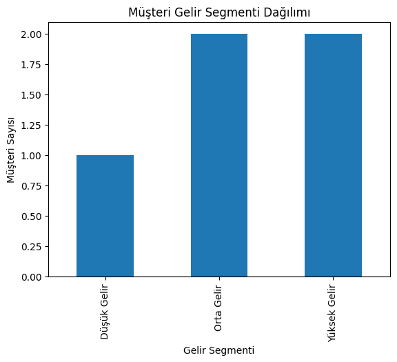
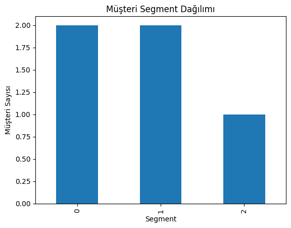

# Banking Customer Segmentation & Credit Decisioning

## Project Overview
This project demonstrates a simplified end-to-end banking analytics pipeline.
It simulates how a junior data scientist can analyze customer data to assess
risk, assign credit scores, make approval decisions, and segment customers.

## Dataset
Synthetic customer-level data including:
- Age
- Monthly income
- Credit card spending
- Late payment behavior

## Workflow
1. Customer profiling and income segmentation
2. Rule-based risk labeling (Low / Medium / High)
3. Credit score assignment (800 / 600 / 400)
4. Credit approval decision using a cut-off score
5. Customer segmentation using K-Means

## Technologies
- Python
- pandas
- matplotlib
- scikit-learn

## Key Business Insights
- Customers with no late payments show higher income and spending behavior
- A cut-off score of 600 results in an 80% approval rate
- Customer segmentation reveals distinct product suitability groups

## Visual Outputs
- Income segment distribution
- Customer segment distribution

## Project Structure

banking-customer-segmentation/
├── data/
├── src/
│ ├── data_loader.py
│ ├── customer_profile.py
│ ├── risk_scoring.py
│ ├── credit_decision.py
│ ├── customer_segmentation.py
│ └── main.py
├── visuals/
│ ├── income_segment_distribution.png
│ └── segment_distribution.png
└── README.md

### Income Segment Distribution

### Customer Segment Distribution

---
This project is created for banking-focused data science portfolio development.
